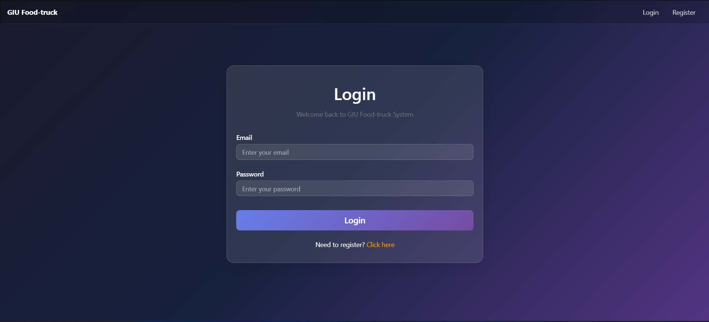
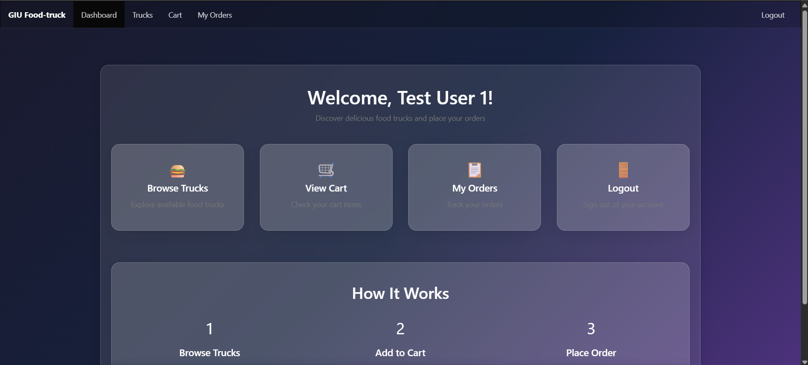
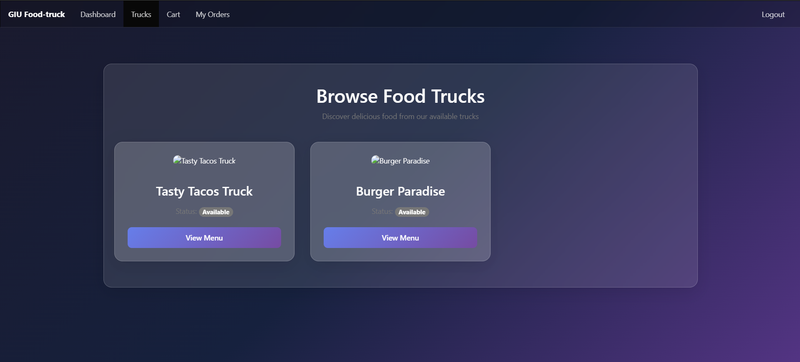
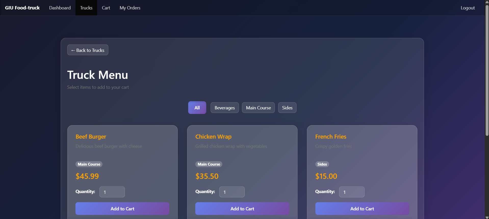
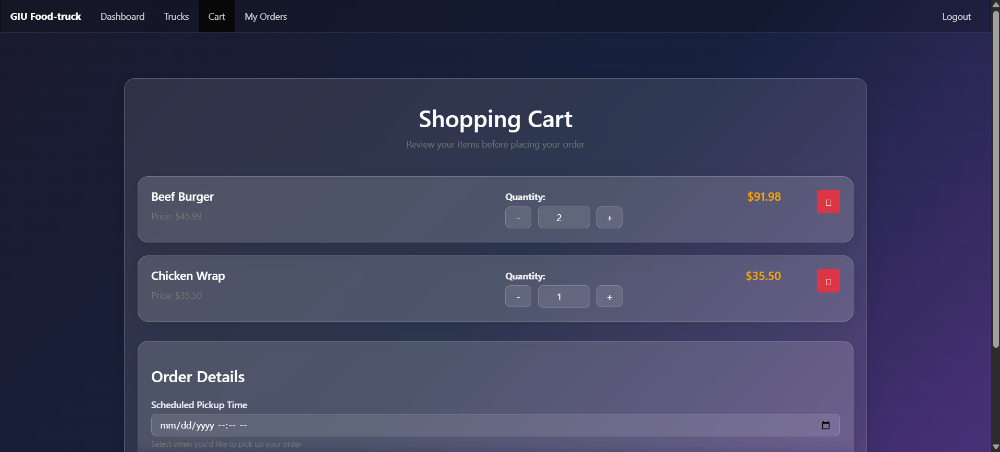
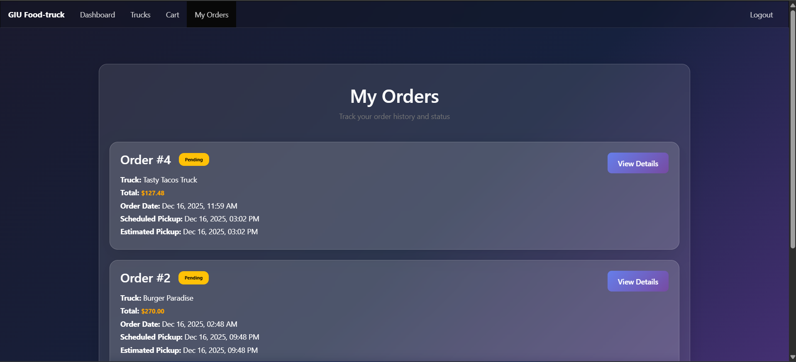
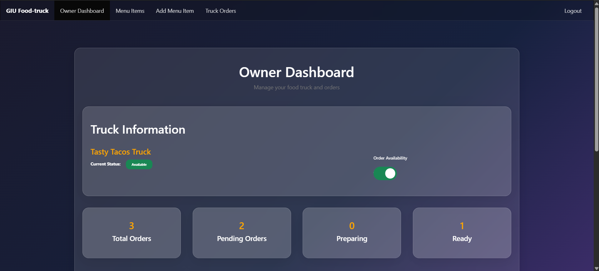
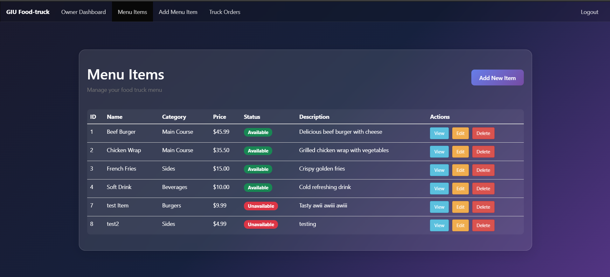
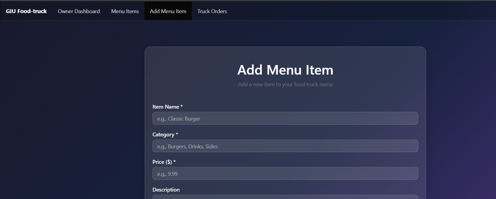
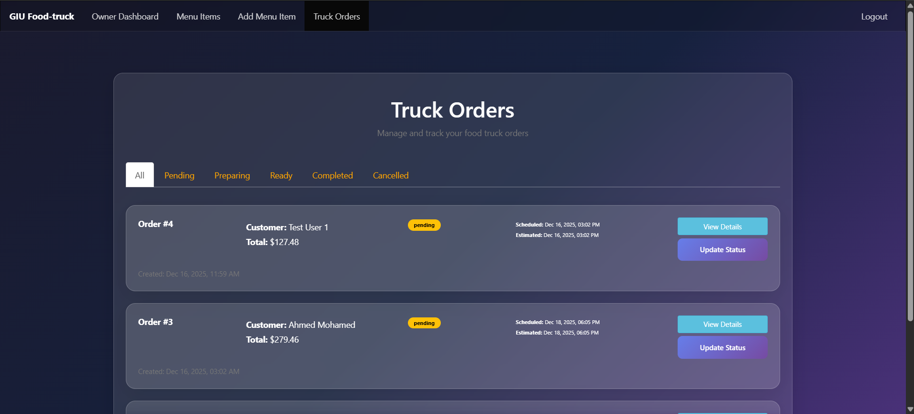

# GIU Food Truck Management System

## Project Title and Description

**GIU Food Truck Management System** is a web-based platform that connects food truck owners with customers, enabling seamless ordering and management of food truck services. The system provides separate interfaces for customers to browse trucks, view menus, place orders, and track their order history, while truck owners can manage their menu items, view orders, and update order statuses.

### Team Members

| Name | ID | Tutorial |
|------|----|----------|
| Mohamed Amr | 16003603 | Tut 19 |
| Kareem Fetouh | 16003115 | Tut 19 |
| Mohamed Omar | 16004421 | Tut 19 |
| Rana Mosaad | 16006190 | Tut 19 |

---

## Features

### Customer Features

- **User Authentication**: Register and login with secure session management
- **Browse Food Trucks**: View all available food trucks with their information
- **View Truck Menus**: Browse menu items for each food truck, organized by categories
- **Search by Category**: Filter menu items by category (Main Course, Sides, Beverages, etc.)
- **Shopping Cart**: 
  - Add items to cart with quantity selection
  - View cart contents with item details and prices
  - Edit item quantities
  - Remove items from cart
  - Automatic validation to prevent ordering from multiple trucks
- **Place Orders**: 
  - Create orders from cart items
  - Schedule pickup times
  - Automatic cart clearing after order placement
- **Order Management**:
  - View order history
  - View detailed order information including items and status
  - Track order status (pending, preparing, ready, completed, cancelled)

### Truck Owner Features

- **Owner Dashboard**: 
  - View truck information and statistics
  - View recent orders summary
  - Toggle truck order availability (available/unavailable)
- **Menu Item Management**:
  - Create new menu items with name, price, description, and category
  - View all menu items for their truck
  - View specific menu item details
  - Edit menu item information (name, price, category, description, status)
  - Delete/Deactivate menu items (soft delete by setting status to unavailable)
- **Order Management**:
  - View all orders for their truck
  - View detailed order information with customer details
  - Update order status (pending → preparing → ready → completed)
  - Set estimated earliest pickup time for orders

---

## Technology Stack

### Frontend
- **HTML/CSS/JavaScript**: Core web technologies
- **Bootstrap 4**: UI framework for responsive design
- **jQuery**: DOM manipulation and AJAX requests
- **HJS (Hogan.js)**: Server-side templating engine
- **Custom CSS**: Styling and animations

### Backend
- **Node.js**: JavaScript runtime environment
- **Express.js**: Web application framework
- **Body Parser**: Middleware for parsing request bodies
- **UUID**: Session token generation
- **Axios**: HTTP client for API requests

### Database
- **PostgreSQL**: Relational database management system
- **Knex.js**: SQL query builder and database migration tool
- **pg**: PostgreSQL client for Node.js

### Development Tools
- **Nodemon**: Development server with auto-reload
- **dotenv**: Environment variable management

---

## ERD (Entity Relationship Diagram)

The database schema consists of the following tables:

### Proposed Tables (from Milestone 2)

1. **app_user**: Stores user accounts (customers and truck owners)
2. **food_truck**: Stores food truck information
3. **menu_item**: Stores menu items for each truck
4. **orders**: Stores order information
5. **order_item**: Stores individual items within each order
6. **review**: Stores customer reviews (future implementation)
7. **notification**: Stores notifications for users (future implementation)
8. **coupon**: Stores discount coupons (future implementation)
9. **order_coupon**: Links orders with applied coupons (future implementation)

### Implemented Database Schema

The current implementation uses the following tables in the `FoodTruck` schema:

1. **Users**: User accounts with roles (customer/truckOwner)
   - userId (PK), name, email, password, role, birthDate, createdAt

2. **Trucks**: Food truck information
   - truckId (PK), truckName, truckLogo, ownerId (FK), truckStatus, orderStatus, createdAt

3. **MenuItems**: Menu items for each truck
   - itemId (PK), truckId (FK), name, description, price, category, status, createdAt

4. **Orders**: Order records
   - orderId (PK), userId (FK), truckId (FK), orderStatus, totalPrice, scheduledPickupTime, estimatedEarliestPickup, createdAt

5. **OrderItems**: Individual items in each order
   - orderItemId (PK), orderId (FK), itemId (FK), quantity, price

6. **Carts**: Shopping cart items
   - cartId (PK), userId (FK), itemId (FK), quantity, price

7. **Sessions**: User session management
   - id (PK), userId (FK), token, expiresAt

### Relationships

- Users (1) → (M) Trucks (one owner can have one truck)
- Trucks (1) → (M) MenuItems
- Users (1) → (M) Orders
- Trucks (1) → (M) Orders
- Orders (1) → (M) OrderItems
- MenuItems (1) → (M) OrderItems
- Users (1) → (M) Carts
- MenuItems (1) → (M) Carts
- Users (1) → (M) Sessions

---

## Installation and Setup

### Prerequisites

- Node.js (v14 or higher)
- PostgreSQL (v12 or higher)
- npm or yarn package manager
- pgAdmin 4 (optional, for database management)

### Step-by-Step Installation

1. **Clone the repository**
   ```bash
   git clone <repository-url>
   cd GIU-Truck-System--Software-Project
   ```

2. **Install dependencies**
   ```bash
   npm install
   ```

3. **Set up PostgreSQL database**
   - Open pgAdmin 4 or PostgreSQL command line
   - Create a new database (e.g., `foodtruck_db`)
   - Note your database connection details (host, port, database name, username, password)

4. **Configure environment variables**
   - Create a `.env` file in the root directory
   - Add the following variables:
     ```env
     DB_HOST=localhost
     DB_PORT=5432
     DB_NAME=foodtruck_db
     DB_USER=your_username
     DB_PASSWORD=your_password
     PORT=3000
     ```

5. **Set up database schema**
   - Open `connectors/scripts.sql` in pgAdmin 4
   - Execute the entire script to create the `FoodTruck` schema and all tables

6. **Seed the database (optional)**
   - Open `connectors/seed.sql` in pgAdmin 4
   - Execute the script to add sample data for testing
   - Note: The sample passwords are hashed - you'll need to register new users or update passwords

7. **Start the development server**
   ```bash
   npm run server
 ```

8. **Access the application**
   - Open your browser and navigate to: `http://localhost:3001`
   - You should see the login page


## Test Credentials

### Option 1: Register New Users

1. Navigate to the registration page: `http://localhost:3001/register`
2. Create a customer account:
   - Fill in name, email, password
   - Select role as "customer"
   - Click Register

3. Create a truck owner account:
   - Fill in name, email, password
   - Select role as "truckOwner"
   - Click Register
   - Note: After registration, you'll need to create a truck for the owner (this may require database insertion or an admin interface)

### Option 2: Use Sample Data

If you've run the seed script, you can use these test accounts (note: passwords in seed.sql are hashed, so you'll need to update them):

**Customer Account:**
- Email: `testUser1@example.com`
- Password: test123

**Truck Owner Account:**
- Email: `sara@example.com` or `khaled@example.com`
- Password: Update password in database to a plain text password for testing


## Screenshots

### Customer Interface

#### Login Page

*User authentication page*

#### Customer Homepage

*Dashboard with quick access to trucks, cart, and orders*

#### Browse Trucks

*List of available food trucks*

#### Truck Menu

*Menu items for a specific truck, organized by categories*

#### Shopping Cart

*Cart view with items, quantities, and total price*

#### My Orders

*Order history with status tracking*

### Truck Owner Interface

#### Owner Dashboard

*Truck owner dashboard with statistics and recent orders*

#### Menu Items Management

*View and manage all menu items*

#### Add Menu Item

*Form to create new menu items*

#### Truck Orders

*View and manage orders for the truck*

---

## API Endpoints Summary

### Public Endpoints (No Authentication Required)

| Method | Endpoint | Description | Request Body |
|--------|----------|-------------|--------------|
| GET | `/` | Login page | - |
| GET | `/register` | Registration page | - |
| GET | `/logout` | Logout and clear session | - |
| POST | `/api/v1/user` | Register new user | `{name, email, password, role, birthDate?}` |
| POST | `/api/v1/user/login` | User login | `{email, password}` |

### Private Endpoints (Authentication Required)

#### Menu Item Management (Truck Owner)

| Method | Endpoint | Description | Request Body |
|--------|----------|-------------|--------------|
| POST | `/api/v1/menuItem/new` | Create new menu item | `{name, price, description, category, status?}` |
| GET | `/api/v1/menuItem/view` | View all menu items for owner's truck | - |
| GET | `/api/v1/menuItem/view/:itemId` | View specific menu item | - |
| PUT | `/api/v1/menuItem/edit/:itemId` | Edit menu item | `{name?, price?, category?, description?, status?}` |
| DELETE | `/api/v1/menuItem/delete/:itemId` | Delete menu item (soft delete) | - |

#### Truck Management

| Method | Endpoint | Description | Request Body |
|--------|----------|-------------|--------------|
| GET | `/api/v1/trucks/view` | View all available trucks (Customer) | - |
| GET | `/api/v1/trucks/myTruck` | View owner's truck information | - |
| PUT | `/api/v1/trucks/updateOrderStatus` | Update truck order availability | `{orderStatus: 'available'\|'unavailable'}` |

#### Menu Items (Customer)

| Method | Endpoint | Description | Request Body |
|--------|----------|-------------|--------------|
| GET | `/api/v1/menuItem/truck/:truckId` | View menu items for a truck | - |
| GET | `/api/v1/menuItem/truck/:truckId/category/:category` | Filter menu items by category | - |

#### Cart Management (Customer)

| Method | Endpoint | Description | Request Body |
|--------|----------|-------------|--------------|
| POST | `/api/v1/cart/new` | Add item to cart | `{itemId, quantity, price}` |
| GET | `/api/v1/cart/view` | View cart contents | - |
| PUT | `/api/v1/cart/edit/:cartId` | Update cart item quantity | `{quantity}` |
| DELETE | `/api/v1/cart/delete/:cartId` | Remove item from cart | - |

#### Order Management

| Method | Endpoint | Description | Request Body |
|--------|----------|-------------|--------------|
| POST | `/api/v1/order/new` | Place new order | `{scheduledPickupTime?}` |
| GET | `/api/v1/order/myOrders` | View customer's orders | - |
| GET | `/api/v1/order/details/:orderId` | View order details (Customer) | - |
| GET | `/api/v1/order/truckOrders` | View truck's orders (Owner) | - |
| GET | `/api/v1/order/truckOwner/:orderId` | View order details (Owner) | - |
| PUT | `/api/v1/order/updateStatus/:orderId` | Update order status (Owner) | `{orderStatus, estimatedEarliestPickup?}` |

#### View Routes (Frontend)

| Method | Endpoint | Description | Access |
|--------|----------|-------------|--------|
| GET | `/dashboard` | Customer/Owner dashboard | Authenticated |
| GET | `/trucks` | Browse trucks page | Customer |
| GET | `/truckMenu/:truckId` | Truck menu page | Customer |
| GET | `/cart` | Shopping cart page | Customer |
| GET | `/myOrders` | Customer orders page | Customer |
| GET | `/ownerDashboard` | Owner dashboard | Truck Owner |
| GET | `/menuItems` | Menu items management | Truck Owner |
| GET | `/addMenuItem` | Add menu item page | Truck Owner |
| GET | `/truckOrders` | Truck orders page | Truck Owner |

### Response Status Codes

- `200`: Success
- `400`: Bad Request (validation errors, missing fields)
- `401`: Unauthorized (not authenticated)
- `403`: Forbidden (wrong role)
- `404`: Not Found (resource doesn't exist)
- `500`: Internal Server Error

---

## Contributors

### Team Member Contributions

#### Mohamed Amr (16003603)
- **Backend**: Initial backend structure, valid statuses arrays, and helper functions
- **Frontend**: Designed customers browsing trucks and viewing their menu items

#### Kareem Fetouh (16003115)
- **Backend**: Created the truck management endpoints
- **Frontend**: Put the foundation for the whole UI and designed the login and register page

#### Mohamed Omar (16004421)
- **Backend**: Created the Order Management endpoints
- **Frontend**: Created the whole UI for truckOwner

#### Rana Mosaad (16006190)
- **Backend**: Created Browse Menu and Cart Management endpoints
- **Frontend**: Implemented the UI for customer adding to cart, placing orders, and viewing his/her orders

---

## Project Structure

```
GIU-Truck-System--Software-Project/
├── connectors/
│   ├── db.js              # Database connection configuration
│   ├── scripts.sql        # Database schema creation script
│   └── seed.sql           # Sample data for testing
├── middleware/
│   └── auth.js            # Authentication middleware
├── public/
│   ├── images/            # Static images
│   ├── js/                # Third-party JavaScript libraries
│   ├── src/               # Frontend JavaScript files
│   │   ├── apiClient.js   # API client utilities
│   │   ├── authGuard.js   # Authentication guard
│   │   ├── cart.js        # Cart functionality
│   │   ├── customerHomepage.js
│   │   ├── login.js
│   │   ├── menuItems.js
│   │   ├── myOrders.js
│   │   ├── ownerDashboard.js
│   │   ├── register.js
│   │   ├── truckMenu.js
│   │   ├── truckOrders.js
│   │   ├── trucks.js
│   │   └── ui.js          # UI utility functions
│   └── styles/            # CSS stylesheets
├── routes/
│   ├── private/
│   │   ├── api.js         # Private API endpoints
│   │   └── view.js        # Private view routes
│   └── public/
│       ├── api.js         # Public API endpoints
│       └── view.js        # Public view routes
├── utils/
│   └── session.js         # Session management utilities
├── views/                 # HJS template files
│   ├── login.hjs
│   ├── register.hjs
│   ├── customerHomepage.hjs
│   ├── trucks.hjs
│   ├── truckMenu.hjs
│   ├── cart.hjs
│   ├── myOrders.hjs
│   ├── ownerDashboard.hjs
│   ├── menuItems.hjs
│   ├── addMenuItem.hjs
│   └── truckOrders.hjs
├── server.js              # Main server file
├── package.json           # Project dependencies
└── README.md              # This file
```

---

## Future Enhancements

Based on the proposed ERD from Milestone 2, the following features are planned for future implementation:

1. **Review System**: Allow customers to rate and review food trucks and menu items
2. **Notification System**: Real-time notifications for order status updates
3. **Coupon System**: Discount codes and promotional offers
4. **Enhanced User Profiles**: User profile management and preferences
5. **Order History Analytics**: Detailed analytics for truck owners
6. **Search Functionality**: Advanced search for trucks and menu items
7. **Payment Integration**: Online payment processing
8. **Location Services**: GPS-based truck location tracking

---

